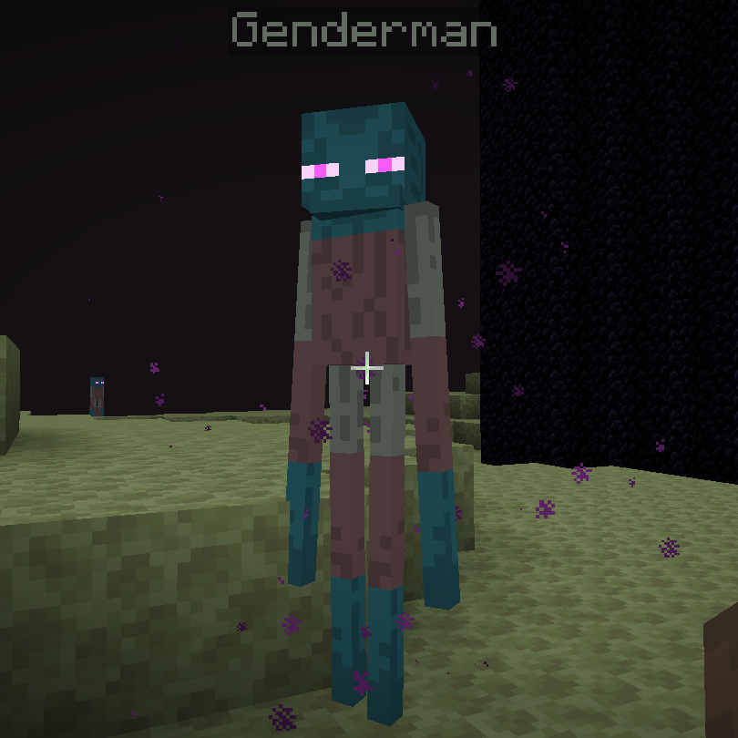

# Genderman

A Minecraft Resource Pack that changes the Enderman's colors to those of the trans flag.

It is not a perfect trans flag, as arms and legs both use the same texture. Feel free to reuse this any way you want (as long as it conforms to mojang's ToS etc.)

# Installation

Copy the [genderman directory](./genderman/) into your Resource Pack folder. You can find that folder by opening Minecraft and then going to `Options -> Resource Packs... -> Open Pack Folder`
